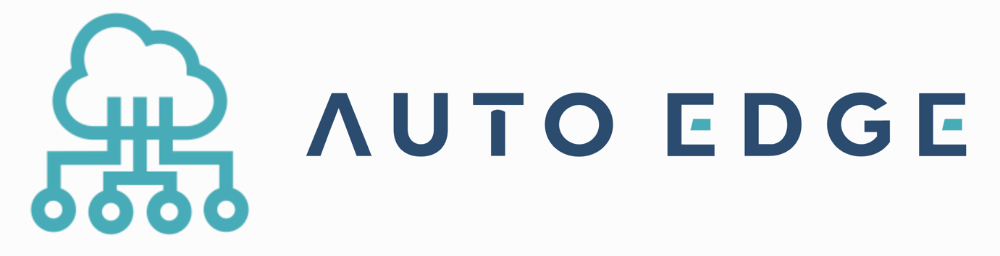
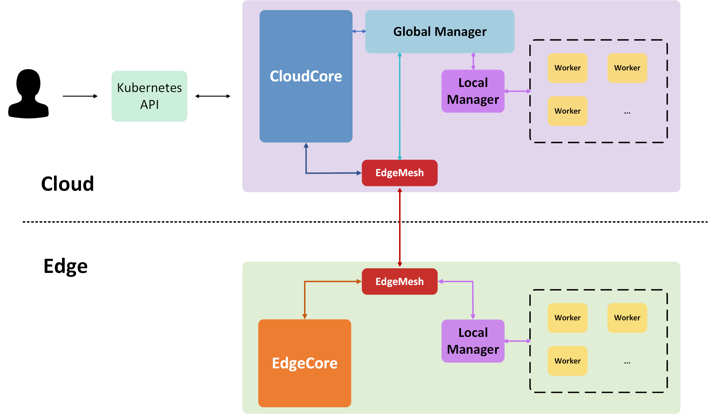
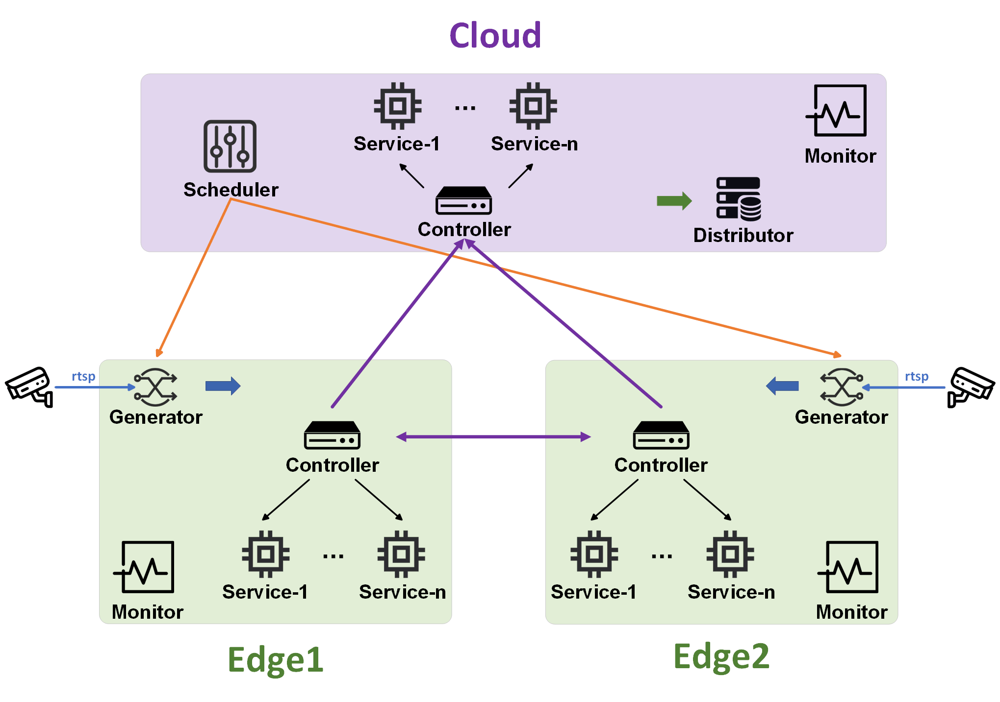

# Auto-Edge





## Brief Introduction


Auto-Edge is an automated scheduling platform for edge computing. Auto-Edge supports pipeline service processing of multi data stream and focus on the scheduling policy in edge computing. It's developed based on KubeEdge and can be easily migrated.

Auto-Edge is developed by Dislab-AIoT group from Nanjin University.

## Related Framework
- [Docker Container](https://github.com/docker/docker-ce)
- [Kubernetes](https://github.com/kubernetes/kubernetes)
- [KubeEdge](https://github.com/kubeedge/kubeedge)
- [Sedna](https://github.com/kubeedge/sedna)
- [TensorRT](https://github.com/NVIDIA/TensorRT)


## Architecture

Auto-Edge is composed of four layers:

- **Basic System Layer**: This layer adopts the `KubeEdge` architecture and is deployed on all distributed nodes across the cloud-edge environment. `KubeEdge` is the `Kubernetes` extension proposed by Huawei for edge scenarios and can be well deployed on devices with limited resources and low performance.
- **Intermediate Interface Layer**: This layer is designed to adapt to the deployment interfaces from platform. Through modifying and expanding official interface component `Sedna`, it will submit a complete task to the user to provide the adaptive parameter interface and the corresponding deployment logic.
- **Collaboration Scheduling Layer**: This layer is composed of functional components independently developed by us to complete functions such as pipeline task execution and scheduling collaboration.
- **Application Service Layer**: This layer accepts user-defined service applications. As long as the user develops service according to the interface requirements defined by the platform, it can be embedded in the platform as a container and complete execution across cloud-edge nodes.

### Basic System Layer & Intermediate Interface Layer




- Basic System Layer 
  - `KubeEdge` use CloudCore and EdgeCore to complete containerized application orchestration and device management among cloud-edge environment.
- Intermediate Interface Layer
  - `Sedna` use Global Manager (GM) and Local Controller (LC) to implement across edge-cloud collaborative applications.
  - According to deployment requirements of platform, we modify the CRD controller in GM and LC of `Sedna` ([link](https://github.com/AdaYangOlzz/sedna-modified)).

**For better understanding, we transform 'Local Controller' of Sedna as 'Local Manager' in the structure*

### Collaboration Scheduling Layer & Application Service Layer

Components in Collaboration Scheduling Layer and Application Service Layer work as Workers in Intermediate Interface Layer.




- `generator`: bind to a data stream and complete the segmentation of data package based on schedule policy from scheduler. 
- `controller`: control the whole process of data dealing and forwarding among cloud and edge devices.
- `service processor`: process data with AI algorithms, a service pipeline may include more than one stage processor.
- `distributor`: collect data processing results and processing information from multi data stream and distribute according to different requirements.
- `scheduler`: generate schedule policy based on resource state and task state, schedule policy includes task offloading and data configuration.
- `monitor`: monitor resource usage like CPU usage, memory usage and network bandwidth.

Among these components, `generator`,`controller`,`distributor`,`scheduler` and `monitor` are embedded in the platform to offer file-grained pipeline task organization and scheduling, and they are invisible to users. The following components make up of the Collaboration Scheduling Layer. 

Meanwhile, `service processor` can be equipped with user-defined application services of single-stage or multi-stage (pipeline). It makes up of Application Service Layer.


## Features
- **Make application services as stateless microservices**: User application services on the platform are all in the form of stateless microservices. Services have nothing to do with the data flow status and system status. They are automatically deployed in containers by the framework and have no node environment dependencies.
- **Compatible across heterogeneous nodes**: The platform is compatible with distributed nodes with different hardware architectures (such as x86/arm64), different performance configurations, and different resource configurations. It can adapt to different physical distances and communication quality among nodes.
- **Support fine-grained real-time scheduling**: The platform can generate task data configuration and task offloading decisions in real time based on working conditions and resource situations, thereby completing fine-grained real-time scheduling of tasks.
- **Support parallel processing of multiple data streams**: The platform supports parallel processing of multiple data streams (for example, cameras at different intersections process traffic flow tasks at the same time). These tasks do not distinguish between data streams during the processing stage and are processed equivalently.


## Guides


### build environment on cloud and edge devices
1. deploy Kubernetes on cloud device([instruction](https://github.com/AdaYangOlzz/kubeedge-deploy))
2. deploy KubeEdge on cloud and edge devices([instruction](https://github.com/AdaYangOlzz/kubeedge-deploy))
3. deploy Sedna (modified version) on cloud and edge devices([instruction](https://github.com/AdaYangOlzz/sedna-modified/blob/master/README.md))

### build docker images of Auto-Edge components
1. install docker cross build (buildx) on x86 platform ([instruction](instructions/buildx.md))
2. build docker with script
```shell
bash docker/build.sh
```
more args of docker building script can be found with `--help`

up-to-date images has been built on [dockerhub](https://hub.docker.com/u/onecheck).


### deploy necessary files on cloud and edge
Some customized files needed to be deployed on devices previously and corresponding paths need to be filled in yaml files.

file structure:
```
cloud device:
- {code_dir}/files
  - schedule_config.yaml
- {code_dir}/model_lib
  - libmyplugins.so
  - yolov5s.engine

edge device:
- {code_dir}/files
  - video_config.yaml
- {code_dir}/model_lib
  - libmyplugins.so
  - yolov5s.engine
```
The 'model_lib' folder contains files for service inference, and it differs among different services.(current is for car-detection).

The template deploying files can be found in [shared link](https://box.nju.edu.cn/d/1c26b20dc733474c9a6b/)

### delete former pods of Auto-Edge
```shell
bash docker/delete.sh
```

### start Auto-Edge system on KubeEdge
start system with yaml files (eg:  [video_car_detection.yaml](templates/video_car_detection.yaml))
```shell
# yaml files can be found in `templates` folder
kubectl apply -f <file-name>
```

find pods of system, default namespace is  `auto-edge`.
```shell
kubectl get pods -n <namespace-name>
```

query the log of pods.
```shell
kubectl logs <pod-name>
```

describe resource for pods.
```shell
kubectl describe pod <pod-name>

```

### start rtsp video stream
Install [`easyDarwin`](https://github.com/EasyDarwin/EasyDarwin) for rtsp server. easyDarwin compiled for arm-64 platform can be found in [shared link](https://box.nju.edu.cn/f/c30a8c8cad1d49938b4b/)

Start easyDarwin rtsp server.
```shell
cd easyDarwin
chmod +x easydarwin start.sh
./start.sh
```

Install `ffmpeg` and start rtsp video stream.
```shell
# multiple video stream binding to different edge
ffmpeg -re -i ./traffic0.mp4 -vcodec libx264 -f rtsp rtsp://127.0.0.1/video0
ffmpeg -re -i ./traffic1.mp4 -vcodec libx264 -f rtsp rtsp://127.0.0.1/video1
ffmpeg -re -i ./traffic2.mp4 -vcodec libx264 -f rtsp rtsp://127.0.0.1/video2
```

You can also use [rtsp script](tools/push.sh) to automatically start video stream.

### collect result from Auto-Edge
use the script to check the system output.
```shell
python tools/result_collector.py
```

or you can mount the data record folder in distributor to volume on physical device


## Deployment Device
- Cloud: Server with NVIDIA GeForce RTX 3090 *4
- Edge: NVIDIA Jetson TX2

## Supported Service Pipeline
- Car Detection: [`car detection`]
- Class Detection: [`face detection`, `pose estimation`] (not completely support now)

## Development Version
- 2023.11.25 `AutoEdge` - `v0.1.0`: demo of car detection (without scheduler) test successfully [single edge, single stage]
- 2023.11.30 `AutoEdge` - `v0.2.0`: demo of car detection (with scheduler) test successfully [single edge, single stage]
- 2023.12.02 `AutoEdge` - `v0.3.0`: build docker image of all components for car detection demo
- 2023.12.04 `AutoEdge` - `v0.4.0`: demo of classroom detection (with scheduler) test successfully [single edge, multi stage]
- 2023.12.11 `AutoEdge` - `v0.5.0`: service of car detection has been transformed by TensorRT 
- 2023.12.11 `AutoEdge` - `v0.6.0`: demo of car detection successfully test on multi-edge [multi edge, single stage]
- 2023.12.13 `AutoEdge` - `v0.7.0`: add logger and collapse processing
- 2023.12.17 `AutoEdge` - `v0.8.0`: add resource monitor component 
- 2024.01.06 `AutoEdge` - `v0.9.0`: build docker images of all components 
- 2024.01.11 `AutoEdge` - `v1.0.0`: complete the first formal version of Auto-Edge
- 2024.02.12 `AutoEdge` - `v1.1.0': rebuild structure of system code

## Citation
